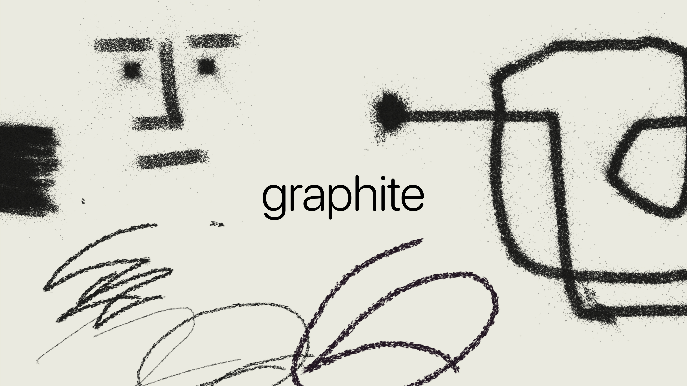
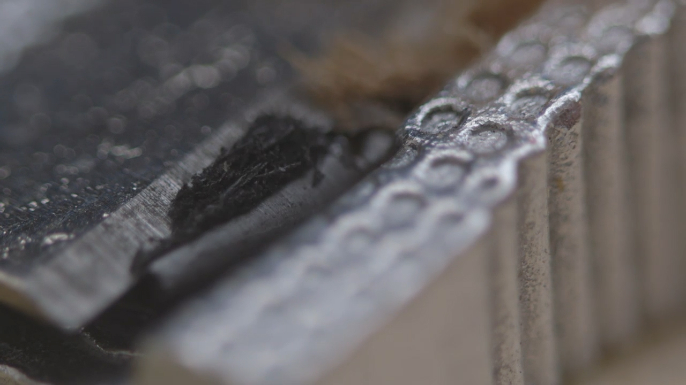
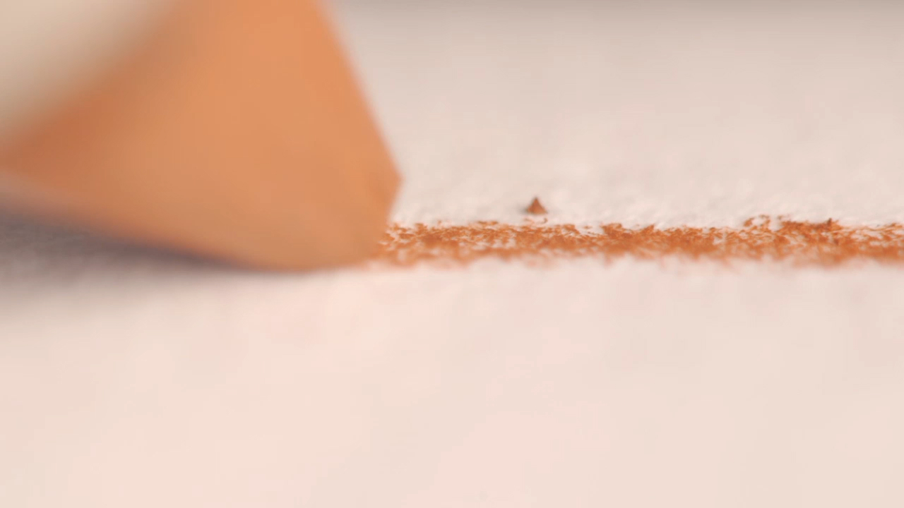
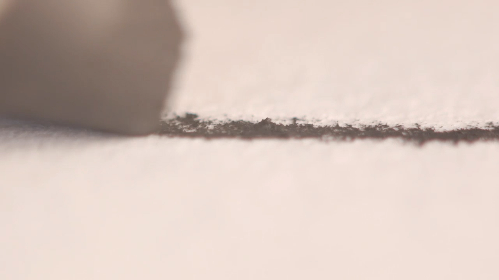
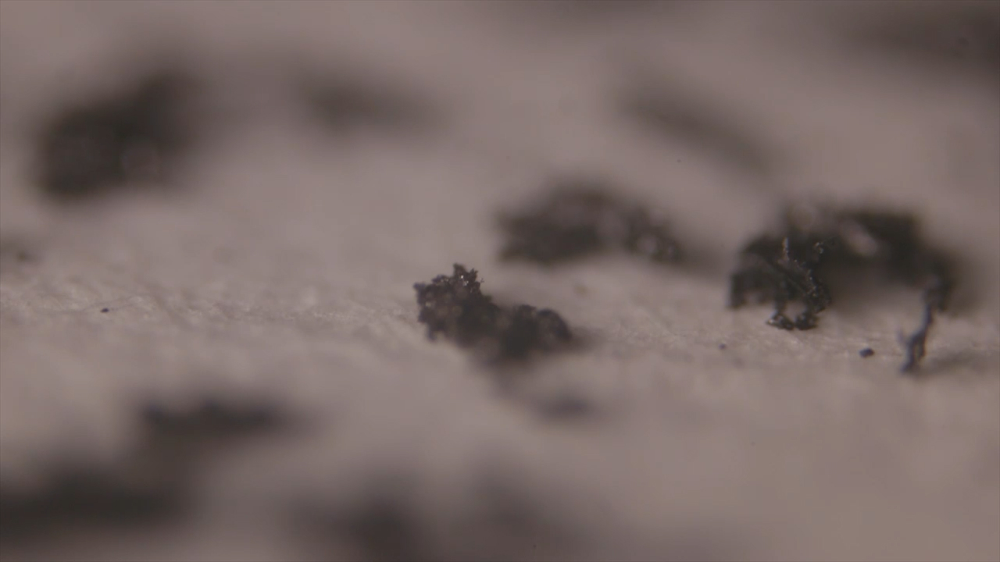

**graphite** (formerly known as **illa**) was originally a research project in 2015-16 where we were interested in exploring different approaches to drawing with computers. This example using a particle system to explore the simulation of various graphite and charcoal drawing tools. Credit to Karsten Schmidt who made the first prototype

Over time the codebase has been gently looked and upgraded, and now been migrated to a new codebase written in Typescript and bun.

We never knew what to do with this project, but we did have a lot of fun taking a prototype to test in a workshop at [Internet Age Media](https://www.iam-internet.com/) in Barcelona.

## Research microscopy

One of the most interesting parts of our experimentation was paying attention to how graphite actually behaves on paper. So we build a custom rig for microscopic filmmaking. Graphite is a fascinating material, that behaves quite strangely when you look up close; almost skidding across the surface of paper.

